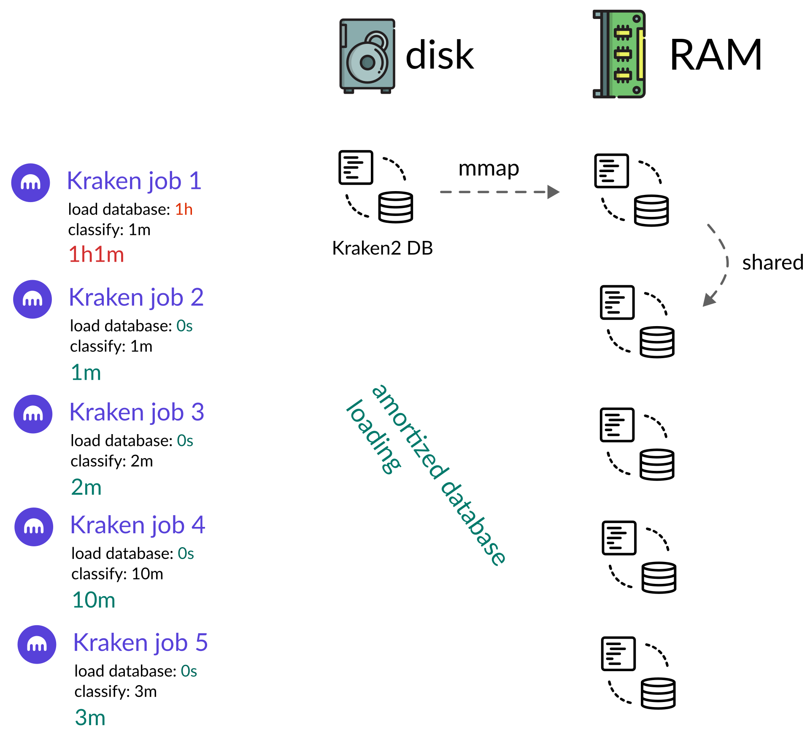

# Strategies and concept for the workflows

## Local memory cashing of Kraken databases

For large Kraken2 databases reading the database into memory will quickly becoming the
largest time sink when classifying. When running many Kraken2 jobs in parallel this can
be circumvented by using shared memory where the first Kraken2 job will load the database
into a memory segment readable by all Kraken2 jobs. This will often show up as "cached"
in your memory overviews. As slong as this cached segment is not freed by the OS, databases
will be loaded instantaneously by all future Kraken2 jobs. This will lead immense performance
gains.

This will usually not work for HPC systems as the jobs will be distributed across different
machines with their own memory and RAM. This is why the Kraken2 steps here allow batching
of Kraken2 jobs into groups that are guaranteed to run on the same machine and thus will
gain the performance benefit. The caveat here is that all jobs in a batch will fail together.
So if one of the Kraken2 jobs crashes all output from the batch is lost. In practice, one
will aim to make the batch as large as possible while still retaining some resilience
for failing jobs.

!!! NOTE

    For single machine setups (local runs) the optimal batch size is always 1.