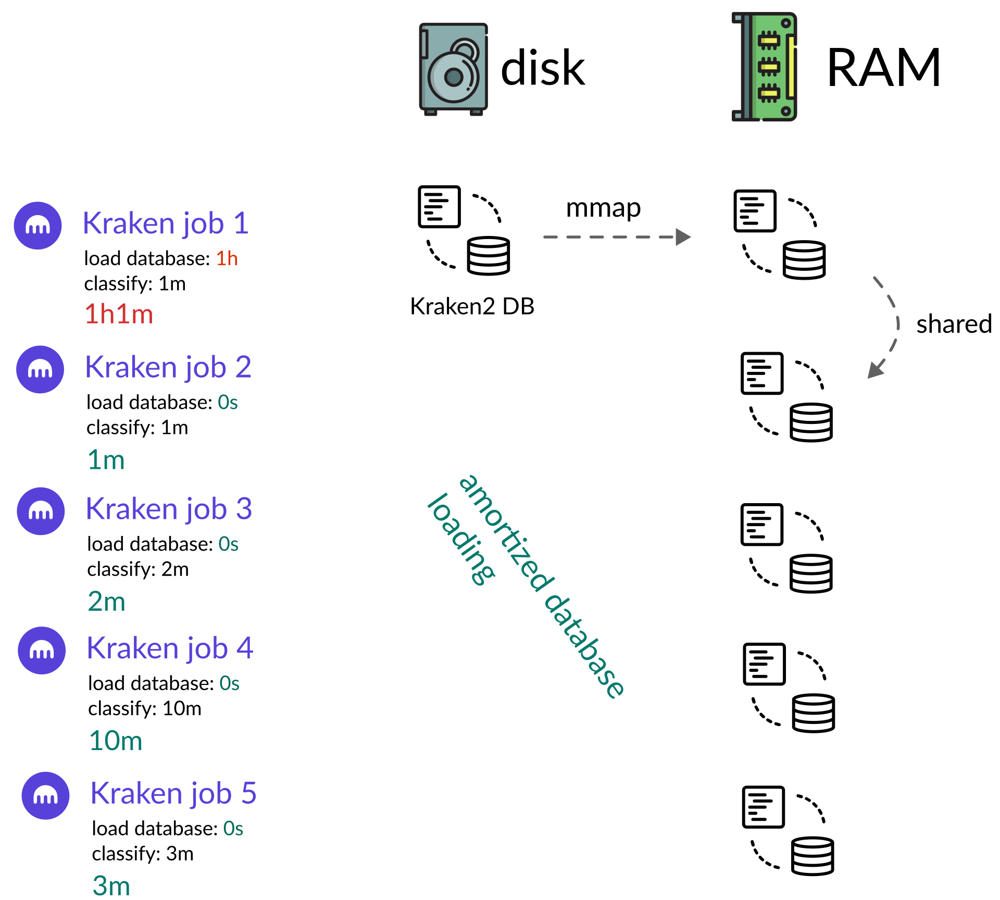

# Metagenomic workflow

**Feasible data:**

- paired or single end metagenomic shotgun sequencing
- any depth

## Basic (functional) workflow

**Definition**: `main.nf`

### Steps:

1. Adapter and quality trimming with [fastp](https://github.com/OpenGene/fastp)
   *quality reports in HTML and JSON are provided for each file*
2. Read annotation with [Kraken2](https://github.com/DerrickWood/kraken2) with some custom HPC optimization
3. Taxon counting using [Bracken](https://github.com/jenniferlu717/Bracken)
4. Assembly with [MegaHit](https://github.com/voutcn/megahit)
5. *De novo* gene prediction with [prodigal](https://github.com/hyattpd/Prodigal)
6. Clustering of all genes on protein identity using [mmseqs2 linclust](https://github.com/soedinglab/MMseqs2)
7. Pufferfish mapping index creation (needed for next step)
8. Gene quantification (mapping + counting) with [salmon](https://salmon.readthedocs.io/en/latest/salmon.html)
9. Protein annotation using the [EGGNoG mapper](https://github.com/eggnogdb/eggnog-mapper)

Additional workflows can be run *after* the basic workflow has finished.

## Replication rates

**Definition**: replication.nf

1. Alignment to [~3K high quality assemblies](https://www.nature.com/articles/s41586-019-1058-x) from the gut microbiome with bowtie2
2. extraction of coverage maps
3. Quanitifaction of peak-to-trough ratios (PTRs) with [coptr](https://github.com/tyjo/coptr)

## Binning workflow

**Definition**: `binning.nf`


### Steps:

1. metagenomic binning with [Metabat2](https://bitbucket.org/berkeleylab/metabat/)
2. assembly taxonomy assignment using [GTDB-TK](https://github.com/Ecogenomics/GTDBTk)
3. quality assessment using [checkM2](https://ecogenomics.github.io/CheckM/)

### Setup

```bash
conda env create -f conda.yml
```

## Options:

```
~~~ Diener Lab Metagenomics Workflow ~~~

Usage:
A run using all,default parameters can be started with:
> nextflow run main.nf --resume

A run with all parametrs set would look like:
> nextflow run main.nf --data_dir=./data --refs=/my/references --single_end=false \
                       --trim_front=5 --min_length=50 --quality_threshold=20 --read_length=150 --threshold=10

General options:
  --data_dir [str]              The main data directory for the analysis (must contain `raw`).
  --read_length [str]           The length of the reads.
  --single_end [bool]           Specifies that the input is single-end reads.
  --batchsize                   The batchsize for Kraken2 processing. Each batch will share a database cache.
Reference DBs:
  --refs [str]                  Folder in which to find references DBs.
  --eggnogg_refs [str]          Where to find EGGNOG references. Defaults to <refs>/eggnog.
  --kraken2_db [str]            Where to find the Kraken2 reference. Defaults to <refs>/kraken2_default.
Quality filter:
  --trim_front [str]            How many bases to trim from the 5' end of each read.
  --min_length [str]            Minimum accepted length for a read.
  --quality_threshold [str]     Smallest acceptable average quality.
  --threshold [str]             Smallest abundance threshold (in reads) used by Kraken.
```

### Some note on the batch processing

The workflow uses a batched Kraken2 setup where several samples are matched against a
cached version of the database which greatly reduces the load time for the Kraken2 database.
In terms of performance the most efficient batch size equals the number of files.

> [!NOTE]
> All samples in a batch will fail together. So if one sample fails the entire batch will.
> For single node systems (single server) the batchsize can be set to 1 and the database
> will be cached server side.

This will look more or less like this:


